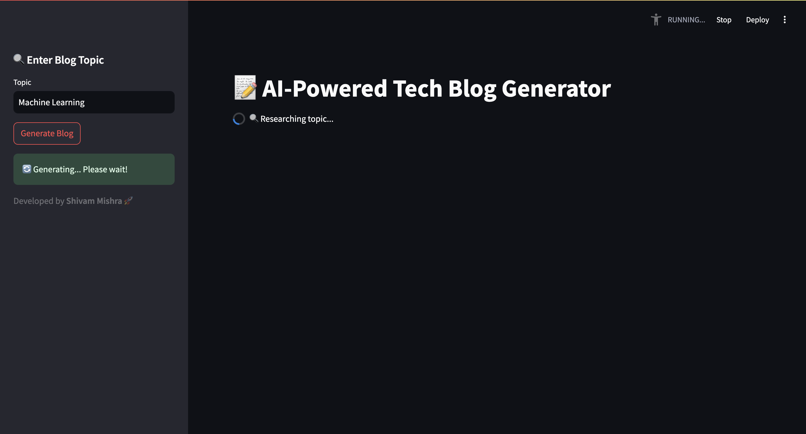
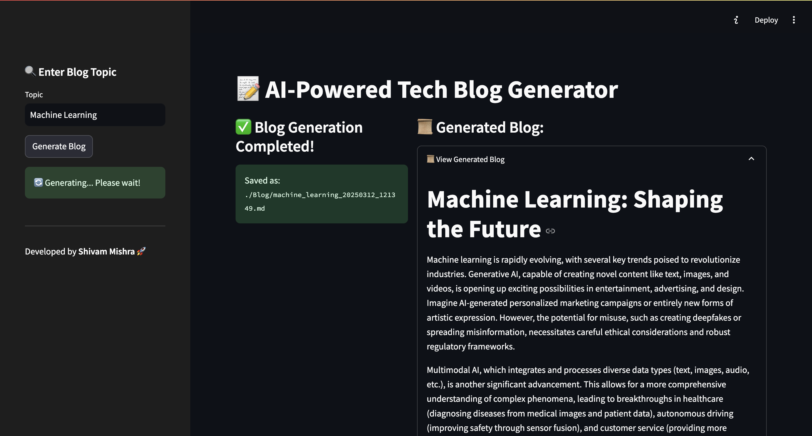

# 🚀 AI-Powered Tech Blog Generator

An intelligent blog generation tool using **CrewAI, LiteLLMs, and Streamlit**. This project automatically researches and writes tech-related blogs based on the given topic.

## 🛠 Features
- **AI-Powered Research & Writing**: Uses CrewAI to generate insightful blogs.
- **Dynamic File Naming**: Saves blogs with timestamps and topic-based filenames.
- **Markdown Preview**: View the generated blog in a formatted preview.
- **Download Feature**: Easily download the generated blog as a markdown file.
- **Step-by-Step UI**: User-friendly interface built with Streamlit.

## 📷 Screenshots
### Blog Generation in Progress


### Blog Generation Completed


## 📌 Installation

### 1️⃣ Clone the Repository
```bash
git clone https://github.com/theshivay/CrewAI-Learning.git
cd CrewAI-Learning
```

### 2️⃣ Create a Virtual Environment & Activate It
```bash
python -m venv .venv  # Create virtual environment
source .venv/bin/activate  # macOS/Linux
.venv\Scripts\activate  # Windows
```

### 3️⃣ Install Dependencies
```bash
pip install -r requirements.txt
```

### 4️⃣ Set Up Environment Variables
Create a `.env` file and add your **Gemini API Key** & **Serper API Key**:
```
GEMINI_API_KEY=your_gemini_api_key
SERPER_API_KEY=your_serper_api_key
```

## 🚀 Usage
Run the Streamlit UI:
```bash
streamlit run app.py
```
Visit **http://localhost:8501/** in your browser.

## 🖥️ Project Structure
```
📂 CrewAI-Learning
├── 📂 assets 
│   ├── generated.png
│   ├── in_progress.png
├── 📂 crewGoogleGemini
│   ├── 📂 Blog          # Stores generated markdown files
│   ├── crew.py          # Main execution script
│   ├── agents.py        # Defines AI agents (Researcher & Writer)
│   ├── tasks.py         # Defines research & writing tasks
│   ├── tools.py         # Configures external tools like Serper API
│   ├── app.py           # Streamlit UI implementation
├── 📝 LICENSE
├── 📝 README.md
├── 📝 requirements.txt
```

## 📝 Example
After running the app, enter a topic (e.g., `AI in Healthcare`), and the AI will generate a well-researched article. You can preview it, edit if needed, and download the markdown file.

## 🤖 Technologies Used
- **CrewAI** (for multi-agent AI workflow)
- **Gemini API** (for content generation)
- **Serper API** (for web search research)
- **Streamlit** (for interactive UI)

## 📌 Future Enhancements
- ✅ Add more AI agents for advanced research.
- ✅ Improve formatting and UI enhancements.
- ✅ Support exporting to multiple formats (PDF, DOCX).

## 💡 Contributing
Feel free to fork this repository, make improvements, and submit a pull request. Contributions are welcome! 🚀

## 🐟 License
This project is licensed under the **MIT License**.

